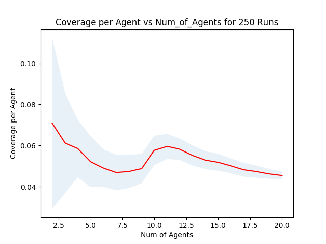

# Gridworld-Reinforcement-Learning
## Updates regarding project

### Updates on 27th Nov, 2019:
1. I have created reward which drops off with time and distance from the agent, i.e, with time the random reward goes to zero and nearer agents gets more reward.
2. Reward: proximity_reward + instant_reward. proximity reward as before and instant_reward = 1000 * reward_parameter * exp(-beta * distance) where reward parameter decayes with time. Reward states are getting generated randomly.
3. **Observation**: Sometimes an agent is staying in a place for a long time, near an instant reward state and not moving in any direction. May be because other action has less Q-values associated with it and it is not able to learn that moving in the direction of reward state will give it higher rewards. 
4. Below is behaviour of when number of agents = 11. Rest can be found at ./GIF/2019-11-26/. White boxes shows reward states and their strengths.

### Updates on 26th Nov, 2019:
1. I have plotted coverage vs k/n for k = 11 and n = (5*5) to (50 * 50). I have plotted the values in both linear and log scale.

Linear x-scale             |  Log x-scale
:-------------------------:|:-------------------------:
  |  

### Updates on 25th Nov, 2019:
1. I have plotted a graph alpha vs coverage. Where alpha is learning rate in the following equation.

2. All the figures for different number of agents can be found under ./Figure/2019-11-23/ . I have shown the graph for 11 agents.

3.  Alpha = 0 means that no update is happening and the agent is moving as per its initial policy. And alpha = 1 means that only the recent update is considered. Our initial policy is a random policy. And surprisingly for any number of agent(2-12), the RL algorithm is doing worse than random.

### Updates on 20th Nov, 2019:
1. I have regenerated the coverage vs num_of_agents curve by averaging over 100 runs. Std. deviation is shown by shaded portion.

2. As there is no clear sweet point for number of agents, I have plotted another graph, i.e., coverage_per_agent vs num_of_agents. Which shows how much each agent is exploring the grid. Initially the value of this metric is high but the total exploration is low. But around 11 agents, the value of this metric is high as well as the toatal exploration.

3. **Traffic Control Problem Formulation Using  RL:**
   * We will create roads in a grid with different probabilities of vehicles taking a turn (Like, a vechicle is more likely to take a highway when it reaches the highway, rather then crossing it).
   * Reward can be movement movement of agent per time unit globally plus a small negative reward for congestion locally.
   * Evaluation Metric: We can compare our model with a round robin solution to check the mobility of the entire grid.

### Updates on 17th Nov, 2019:
1. Created a variable sized gridworld with variable number of agents
2. Implemented the coverage metric
3. Added a new action: 's' (remain in the same state)
4. Beta = 2.5
5. k = 50 for calculating coverage

   

### Updates on 16th Nov, 2019:

1. Changed the state representation to the state value.
2. Created animation to see the behavior of the agent under different beta value.
3. **Observation**: After changing the state representation, the average distance between the agents increases with the increase in beta value. Shown in graph:

4. For Beta Value = 11.8367 the agents are behaving int he following way (Rest can be found inside GIF folder):

### Updates on 12th Nov, 2019:

1. I have calculated the average distance per iteration.
2. Plotted the graph for the distance vs number of iterations for every beta value(Can be found at Figure/2019-11-12 folder).
3. Calculated and plotted the average distance per beta value.
4. **Observation**: The two agents remain in the same state as the distance between the distance between the two agents is constant and they take the same action.

### Updates on 1st Oct, 2019:

1. I tried giving rewards for proximity as **exp(beta\*distance)**.
2. I tried beta with values from -20 to +20. I used 50 values, linearly spaced among them.
3. I used a metric unique_states_traversed. Which counts the number of unique states visited by the agent in an epoch. The details are given below.
4. Hyperparameters:
    *  Epoch Length: 500
    *  Number of Epochs: 100
    *  Reward States: (3,3) and (3,4) with zero indexing having rewards drawn from Normal(101,101) and Normal(102,102)
5. I have plotted graphs of unique_states_traversed for each value of beta for 100 iterations. Red line shows the mean value of unique_states_traversed for each beta value. Graphs can be found at "./Figure/01_Oct_2019/" folder.
6. **Observation**: As we increase the beta value the mean value of unique_states_traversed is decreasing. But as there is no negetive reward for steps the agent is roaming around the entire gridworld. Also when the reward is really high for maintaing distance, it does not roam around the reward states very often.
7. Graph Naming Convention: Agent_NameHere_BetaValue_ValueHere

### Updates on 26th Sept, 2019:

**Using proximity as state representation**
1. When I did not give proximity reward, agents were exploring the entire grid and one agent was roaming around the awerd states.
2. When I gave reward as -distance, the agents were stuck at both corners near starting points and never crossing each other. They are also showing signs of maintaing distance.

Colour represents the direction of the max Q-value(i.e action corresponding to the maximum Q value). 

In plots:

Purple -> Left;  Cyan -> Right;  Yellow -> Up; Red -> Down

